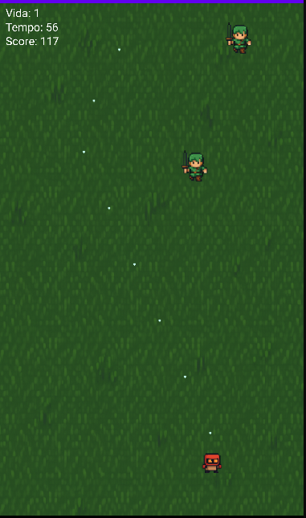

# 🎮 MiniSurvivors

MiniSurvivors é um jogo Android desenvolvido como trabalho acadêmico no curso de Análise e Desenvolvimento de Sistemas. O objetivo é sobreviver o maior tempo possível evitando inimigos em um cenário com estilo pixelado retrô.

## 🕹️ Funcionalidades

- Movimento do jogador com toques na tela
- Inimigos que perseguem o jogador
- Sistema de pontuação e recorde com `SharedPreferences`
- Tela de Game Over e tela de Vitória
- Gráficos em pixel art, HUD visível e fundo animado

## 🔧 Tecnologias usadas

- Kotlin
- Android SDK
- Android Studio
- Canvas (View customizada)


Adicione aqui uma imagem do jogo rodando:
## 📸 Captura de Tela



```

## 👨‍💻 Autor

Christian Alex Silva Sena  
[Meu LinkedIn](https://www.linkedin.com/in/christian-alex-448a62199/)  
[Meu GitHub](https://github.com/Christian-Alex7)

---

Feito com 💙 para fins acadêmicos.
